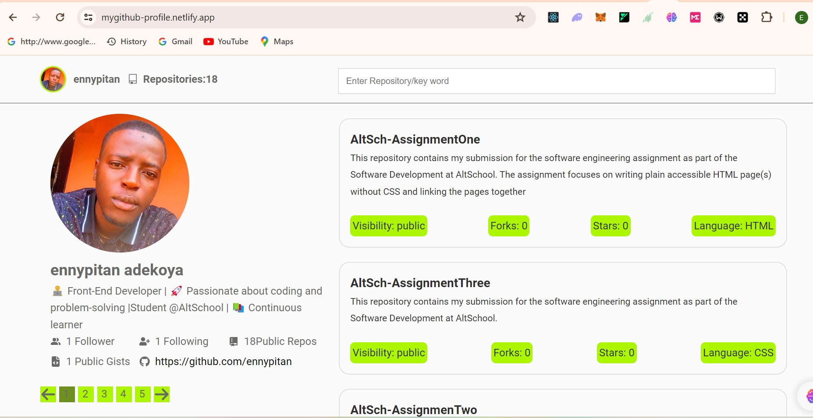

# Mygithub-Profile

[Live Project Link](https://mygithub-profile.netlify.app/)

## Description

This project is an implementation of a web application using the GitHub API to fetch and display a user's GitHub repositories portfolio. The main features include listing all repositories with pagination, implementing search and filter functionality, displaying details of a single repository, implementing an error boundary, and showcasing a custom 404 page.

#### Features

1.  ##### List Repositories

- Display all GitHub repositories with pagination enabled.
- Implement search and filter functionality to enhance repository navigation.

2.  ##### Repository Details

- Show detailed information for a selected repository when clicked from the list.

3. ##### Error Boundary

- Implement an error boundary component to gracefully handle errors within the application.

4. ##### 404 Page

- Create a custom 404 page to handle unknown routes and improve user experience.

5. ##### UI and Accessibility

- Focus on good layout, UI design, and accessibility techniques to ensure a user-friendly experience.

#### Technologies Used

**React.js:** Frontend library for building user interfaces.
**GitHub API:** Access GitHub data such as repositories and repository details.
**React Router:** Handle routing and nested routes within the application.
**Error Boundary:** Implement error boundaries to catch and display errors.
**VanillaCSS:** Structure and style the web pages using style component
**JavaScript (ES6+):** Programming language for application logic.

#### Installation and Setup

- Clone the repository to your local machine.
- Navigate to the project directory.
- Install dependencies using npm install or yarn install.
- Start the development server with npm start or yarn start.
- Access the application in your browser at http://localhost:3000.

#### Contribution

Contributions are welcome! If you find any bugs or have suggestions for improvement, please open an issue or submit a pull request.

#### Credits

This project is created by **Ennypitan Adekoya** as a Second Semester Project at **AltSchool Africa School of Ebgineering**
